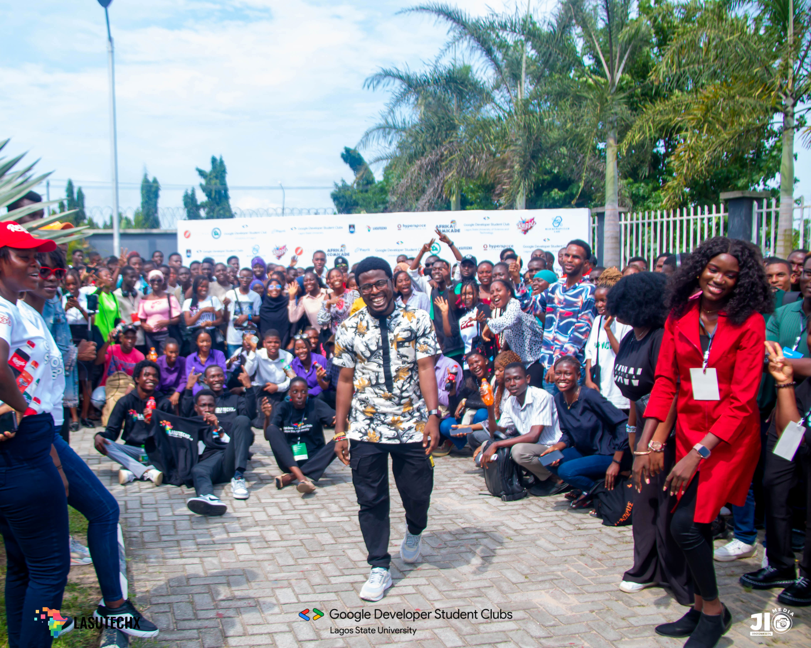

# LASU TECH X 5.0 — DP Generator

The official profile picture generator for **LASU TECH X 5.0**. Show your support and tell the world you're attending the flagship student technology conference at Lagos State University.



## 🚀 Features

- **Interactive Canvas Editor**: Upload your photo and use intuitive controls to scale, zoom, and reposition it perfectly within the frame.
- **Official Branding**: Features the official LASU TECH X 5.0 event frame.
- **Privacy First**: All image processing happens locally in your browser. Your photos are never uploaded to any server.
- **High Quality**: Exports a crisp 1080x1080 PNG ready for use on Twitter, LinkedIn, WhatsApp, and more.
- **Premium Design**: Built with a sleek, dark-themed UI, modern typography (Syne & DM Sans), and smooth animations.

## 🛠️ Tech Stack

- **Framework**: [Next.js 15+](https://nextjs.org/) (App Router)
- **Language**: [TypeScript](https://www.typescriptlang.org/)
- **Styling**: [Tailwind CSS v4](https://tailwindcss.com/)
- **Icons**: [Lucide React](https://lucide.dev/)
- **Animations**: [tw-animate-css](https://github.com/designbyadrian/tw-animate-css)
- **Rendering**: HTML5 Canvas API

## 🏁 Getting Started

### Prerequisites

- Node.js 18.x or later
- npm / pnpm / yarn

### Installation

1. Clone the repository:
   ```bash
   git clone https://github.com/o1-spec/lasu-techx-dp-generator.git
   cd lasu-techx-dp-generator
   ```

2. Install dependencies:
   ```bash
   npm install
   ```

3. Run the development server:
   ```bash
   npm run dev
   ```

4. Open [http://localhost:3000](http://localhost:3000) with your browser to see the result.

## 📁 Project Structure

- `src/app`: Next.js App Router pages and global styles.
- `src/components`: Reusable UI components.
- `src/components /dp-generator-section.tsx`: The core canvas-based generator logic.
- `public/`: Static assets including the official `frame.png`.

## 🤝 Contributing

Contributions are welcome! If you've found a bug or have a feature suggestion, feel free to open an issue or submit a pull request.

## 📄 License

This project is licensed under the MIT License.

---

Built with ⚡️ by the **GDG LASU Community**.
